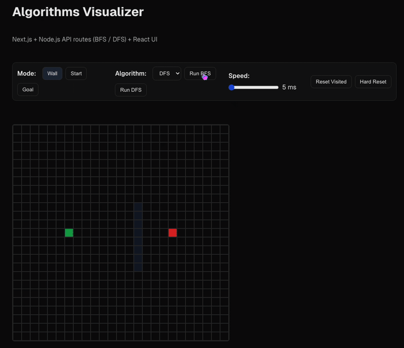

# Algorithms Visualizer (Next.js + Node.js API + React)

An interactive visualization tool for graph traversal algorithms.  
Built with **Next.js (React UI)** and **Node.js API routes**.

## 🚀 Demo


## ⚡ Features
- Place **Start** and **Goal** nodes on a grid
- Draw **Walls** to block paths
- Run **BFS** or **DFS** with animated step-by-step exploration
- Automatic path reconstruction (highlighted in blue)
- Adjustable **speed slider**
- **Reset Visited** and **Hard Reset** options
- Works in both light and dark mode

## 🛠 Tech Stack
- [Next.js](https://nextjs.org/) (Pages Router)  
- React (hooks, functional components)  
- Node.js API routes (serverless functions for BFS/DFS)  
- Plain CSS (with dark mode support)

## 📦 Quick Start

Clone the repo and install dependencies:
```bash
git clone https://github.com/<your-username>/algovis.git
cd algovis
npm install
Run the development server:

bash
Copy code
npm run dev
Open http://localhost:3000 to view the app.

Build for production:

bash
Copy code
npm run build
npm start